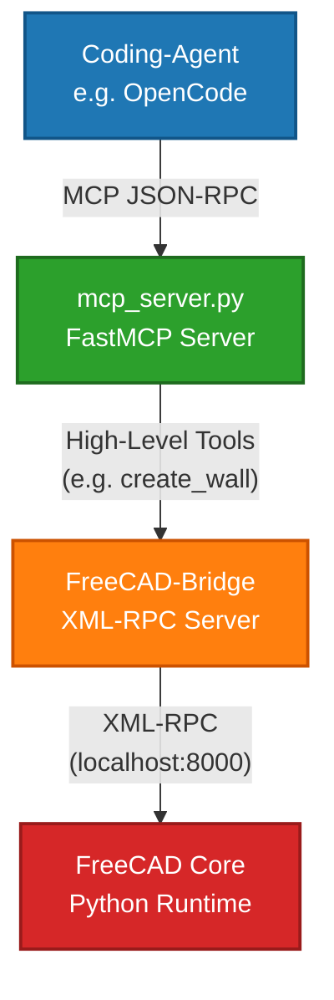

*Read this in other languages: [English](README.md), [Deutsch](README.de.md).*

# **freecad-bim-agent** — FreeCAD MCP Server

This repository contains a **Model Context Protocol (MCP)** server that provides a seamless bridge between AI models (LLMs) and **FreeCAD**. Built on the FastMCP framework, it enables AI assistants to generate, modify, analyze, and visually verify complex 3D models, parametric parts, and complete **BIM (Building Information Modeling)** structures directly in FreeCAD.  
The MCP server is specifically designed to integrate natively with **coding agents**, enabling autonomous AI-driven CAD and BIM workflows. It has been successfully tested with [**OpenCode**](https://opencode.ai/).  
Communication with FreeCAD happens via an XML-RPC interface (FreeCAD Bridge) that interprets commands and executes them directly in the FreeCAD Python runtime.

## **System Architecture**

The server acts as a translator between the standardized MCP protocol and the FreeCAD API:



## **Features & Capabilities**

* **Optimized for Coding Agents:** Tailored tool structures for autonomous agents like OpenCode for AI-assisted design.  
* **Parametric CSG Modeling:** Create primitives (cubes, cylinders, spheres) with native unit support (mm, cm, m).  
* **Advanced BIM/Architecture Tools:** Structured creation of IFC-compliant entities like Sites, Buildings, Floors, Walls, Slabs, Roofs, and Stairs.  
* **Automated Wall & Window Placement:** Intelligent wall alignment (inside/outside edge) and precise cut-in placement of windows and doors.  
* **Space/Volume creation:** IFC-compliant rooms based on solids or boundary faces via `create_space` and `add_space_boundary`.  
* **Draft & 2D Drawing Tools:** Create lines, polylines, circles, text, and dimensions in 3D space.  
* **Model Validation & Quality Control:** Preflight checks for invalid geometry, bounding-box overlaps, and IFC compliance before export.  
* **Visual Feedback:** Render and return 3D views as Base64/PNG images to the AI model for visual verification.  
* **The Ultimate Escape Hatch (execute\_python):** Enables the AI to run arbitrary Python code directly inside FreeCAD to fill gaps for highly specific operations.

## **⚠️ IMPORTANT SECURITY NOTICE (execute\_python)**

The `execute_python` tool is extremely powerful and serves as a fallback for operations not covered by specialized tools. **Executing arbitrary Python code poses significant security risks** (e.g., unauthorized file access, system commands, or malicious code execution if the LLM behaves unpredictably).

* **Security Risk:** `execute_python` runs agent-generated code with the full privileges of the local user running FreeCAD.  
* **Bridge-Start Prompt:** When loading the bridge, a Qt dialog (or console prompt) explicitly asks for permission. Without confirmation, `run_python` blocks with an error message. Reactivation requires a FreeCAD restart.

## **Installation & Setup**

### **1\. Prerequisites**

* Python 3.10 or higher  
* A running FreeCAD instance with the **FreeCAD Bridge** active (XML-RPC server on port 8000).  
* A compatible MCP agent (tested with **OpenCode**).

### **2\. Install Dependencies**

Install the required Python packages via pip:

Bash  
pip install mcp python-dotenv

### **3\. Environment Variables (.env)**

Create a `.env` file in the root directory if you need to customize default settings (loaded via `load_dotenv()`).

### **4\. Connect the Server to OpenCode / Coding Agents**

Add the server to your agent's MCP configuration file:

```JSON  
{
  "mcp": {
    "FreeCAD": {
      "type": "local",
      "command": [
        "/path/to/freecad-bim-agent/.venv/bin/python3",
        "/path/to/freecad-bim-agent/mcp_server.py"
      ],
      "enabled": true
    }
  }
}
```

## **API & Tool Reference**

The server registers a wide range of tools. Below is a structured overview of all available MCP tools, organized by category:

### **1\. Basic Construction & Transformations (CSG)**

| Tool | Arguments | Description |
| :---- | :---- | :---- |
| create\_cube | length, width, height (strings with units) | Creates a parametric box. |
| create\_cylinder | radius, height (strings with units) | Creates a cylinder. |
| create\_sphere | radius (string with units) | Creates a sphere. |
| set\_position | name (Str), x, y, z (Floats) | Moves an object to absolute coordinates (in meters). |
| rotate\_object | name (Str), axis (X/Y/Z), angle (Float) | Rotates an object around the specified axis (degrees). |
| clone\_object | source\_name, new\_name | Creates a parametric Draft Clone. |
| mirror\_object | source\_name, axis, origin\_x/y/z, new\_name | Mirrors an object across a defined axis plane. |

### **2\. Boolean Operations & Modifiers**

| Tool | Arguments | Description |
| :---- | :---- | :---- |
| boolean\_union | obj\_a, obj\_b | Fuses two objects. |
| boolean\_cut | base\_obj, tool\_obj | Subtracts tool\_obj from base\_obj (e.g., for cutouts). |
| boolean\_cut\_finalize | cut\_result, new\_label, container, hide\_sources | Finalizes a cut: renames the result, hides source objects, sorts into a floor. |
| fillet | object\_name, radius, edge\_indices | Fillets edges of an object. |
| chamfer | object\_name, length, edge\_indices | Chamfers edges of an object. |

### **3\. BIM & Architecture (Arch/BIM Workbench)**

| Tool | Arguments | Description |
| :---- | :---- | :---- |
| create\_site | name | Creates a project site (Arch Site). |
| create\_building | name | Creates a building structure (Arch Building). |
| create\_floor | name | Creates a floor / storey (Arch Floor). |
| add\_to\_container | object\_name, container\_name | Assigns an object hierarchically (e.g., wall into floor). |
| add\_to\_container\_batch | object\_names (List\[Str\]), container\_name | Assigns multiple objects to a container at once. |
| create\_slab | length, width, height, name, placement\_x/y/z | Creates a floor or ceiling slab. |
| create\_slab\_with\_openings | *Same as Slab*, + openings (List\[Dict\]) | Creates a slab with predefined openings. |
| create\_wall | p1 \[X,Y,Z\], p2 \[X,Y,Z\], width, height, name | Creates a straight wall between two 3D points (in METERS). |
| join\_walls | walls (List\[Str\]) | Joins multiple walls into a single object. |
| add\_to\_wall | wall\_name, component\_name | Inserts a window/door into a wall (Host relationship). |
| align\_wall | wall\_name, align, align\_to | Aligns the wall relative to its baseline (Left, Center, Right, inside, outside). |
| align\_walls\_in\_container | container, ref\_at ("outside"/"inside") | Automatically aligns all walls in a floor by cardinal direction. |
| set\_wall\_alignment | wall, ref\_at\_outside (Bool) | Moves the reference line to the outer edge and adjusts alignment. |
| create\_window | wall\_ident, distance\_from\_start, width, height, sill\_height, windowtype, name | Inserts a window/door into a wall. Automatically cuts the wall opening. |
| create\_window\_sketch | wall\_ident, width, height, sill\_height, name | Creates a custom window based on a sketch. |
| create\_roof | basewire (List\[List\[float\]\]), overhang, thickness, angle, name | Generates a roof from a closed polygon outline. |
| create\_stairs | length, width, height, steps\_count, stringer\_thickness | Creates a parametric staircase. |
| create\_opening | base\_object, shape, position \[X,Y,Z\], size \[W,H,D\], name | Creates a cutout in a building element via Boolean Cut. |
| copy\_to\_floor | source\_walls (List\[Str\]), target\_floor, z\_offset, x\_extension | Copies walls to another floor with height offset. |
| create\_attika | roof\_slab, height, thickness, offset, name\_prefix | Automatically generates parapet walls along a roof slab perimeter. |
| create\_space | base\_object (opt.), name | Creates a room (Arch Space) from a solid or as empty volume. |
| add\_space\_boundary | space\_name, object\_name, faces (opt.) | Adds boundary faces to a space. |
| remove\_space\_boundary | space\_name, object\_name, faces (opt.) | Removes boundary faces from a space. |

### **4\. Axes & Section Planes**

| Tool | Arguments | Description |
| :---- | :---- | :---- |
| create\_axis | x, y, z, direction (X/Y/Z), label | Creates a single building axis. |
| create\_axes | axes (List\[Dict\]) | Batch creation of multiple building axes in one call. |
| create\_axis\_system | axes (List\[Str\]), name | Groups multiple axes into an axis system. |
| create\_section\_plane | x, y, z, direction, name | Creates a section plane for floor plans and views. |

### **5\. MEP & Special Structures**

| Tool | Arguments | Description |
| :---- | :---- | :---- |
| create\_structure | length, width, height, name, position\_x/y/z (opt.) | Creates structural elements like beams or columns. Optional position in meters. |
| create\_panel | length, width, thickness, name | Creates an Arch Panel. |
| create\_curtain\_wall | basewire, panel\_width, panel\_height, name | Creates a glass curtain wall along a path. |
| create\_pipe | basewire, outer\_diameter, wall\_thickness, name | Creates a pipe system along a 3D path. |
| create\_duct | basewire, width, height, name | Creates a rectangular duct via Sweep operation. |

### **6\. Draft (2D Drawing & Documentation)**

| Tool | Arguments | Description |
| :---- | :---- | :---- |
| create\_point | x, y, z, name | Creates a reference point. |
| create\_line | p1, p2, name (Strings) | Creates a Draft line (supports unit strings). |
| move\_line | line, start \[X,Y,Z\], end \[X,Y,Z\] | Moves a line's start and end points. |
| create\_polyline | points (List), closed (Bool), name | Creates an open or closed wire. |
| create\_rectangle | length, width, placement\_x/y/z | Creates a flat rectangle. |
| create\_circle | radius, placement\_x/y/z | Creates a Draft circle. |
| create\_arc | center\_x/y/z, radius, start\_angle, end\_angle | Creates a circular arc. |
| create\_text | text, x, y, z, font\_size, name | Places text in 3D space. |
| create\_dimension | p1, p2, p3, name | Creates a 2D/3D dimension between two points. |

### **7\. Data, IFC Management & Export**

| Tool | Arguments | Description |
| :---- | :---- | :---- |
| set\_ifc\_data | object\_name, properties\_json | Assigns custom IFC properties (Psets) to objects. |
| set\_material | object\_name, material\_name, color\_rgb | Assigns a material and visualization color (R,G,B). |
| set\_material\_batch | object\_names (List\[Str\]), material\_name, color\_rgb | Assigns the same material to multiple objects at once. |
| get\_quantities | object\_name | Calculates area, volume, and mass of an object. |
| export\_ifc | file\_path | Exports the entire model as a standardized BIM IFC file (fallback via Arch.export). |
| analyze\_ifc | file\_path | Analyzes an IFC file externally and returns project statistics. |
| create\_schedule | object\_type, properties, name | Creates an automated parts list (Arch Schedule). |
| create\_2d\_view | source\_name, direction, name | Generates a TechDraw 2D projection (floor plan / section). |
| export\_dxf / import\_dxf | file\_path | Exports/imports CAD data in DXF format. |
| export\_pdf / export\_svg | file\_path | Exports TechDraw sheets as vector graphics or PDF. |

### **8\. Administration, Validation & Diagnostics**

| Tool | Arguments | Description |
| :---- | :---- | :---- |
| list\_objects | *none* | Returns a list of all objects with Label → Name mapping. |
| get\_object\_info | object\_name | Returns detailed metadata (Type, BoundingBox, State, Volume, Baseline) of an object. |
| rename\_object | object, new\_label | Changes the visible label of an object. |
| set\_visibility | object, visible (Bool) | Toggles visibility in the 3D viewport. |
| delete\_object | name | Permanently deletes an object from the document. |
| boolean\_cut\_finalize | cut\_result, new\_label, container, hide\_sources | Finalizes a cut: renames, hides sources, sorts into container. |
| capture\_view | view\_type ("iso"/"top"/"front"/"right") | **Returns an mcp.Image (PNG).** Takes a screenshot of the current 3D viewport for visual verification. |
| validate\_model | *none* | Validates the model for errors (Invalid flags), collisions, invalid bounding boxes, and orphaned objects. |
| validate\_ifc\_export | *none* | Preflight check for missing IFC data/materials before export. |
| execute\_python | script (Python-Code) | **Security-critical.** Executes native Python code in the FreeCAD context. Enabled/disabled via Qt dialog at bridge startup. |

## **Code Architecture (mcp\_server.py)**

The code is designed with robust, defensive patterns:

1. **FastMCP Instantiation:** The server is declared via `mcp = FastMCP("FreeCAD")`.  
2. **Fault-Tolerant XML-RPC Communication:** Every tool wraps the bridge call in a try-except block. If FreeCAD throws an error (e.g., geometry instability or missing objects), it is caught and returned as a readable string to the agent. This prevents MCP server crashes and allows the coding agent (e.g., OpenCode) to autonomously apply error corrections.  
3. **Type-Safe Image Conversion:** The `capture_view` tool receives image data as a Base64 string from the FreeCAD Bridge, decodes it to native bytes, and uses FastMCP's `Image` class to provide the language model with real visual scene understanding for verification. Supports multiple view types (iso, top, front, right).  
4. **Batch Operations:** Tools like `add_to_container_batch` and `set_material_batch` reduce the number of required tool calls for bulk operations from 30+ down to 2–3 calls.  
5. **Retry Mechanism:** The bridge dispatch (`_dispatch`) automatically retries failed requests (2 attempts with 45s timeout) to avoid sporadic timeout errors.

## **License**

This project is licensed under the **MIT License**. See LICENSE for details.
